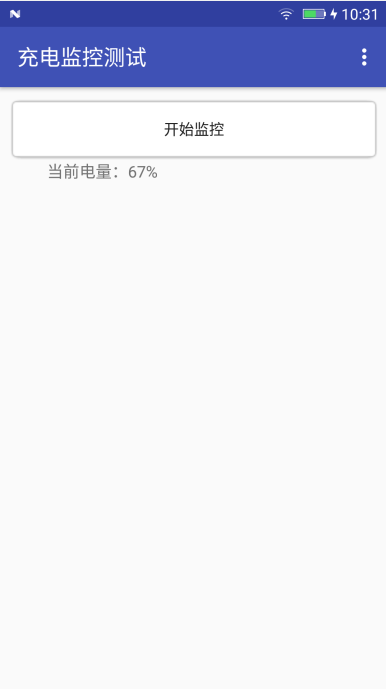
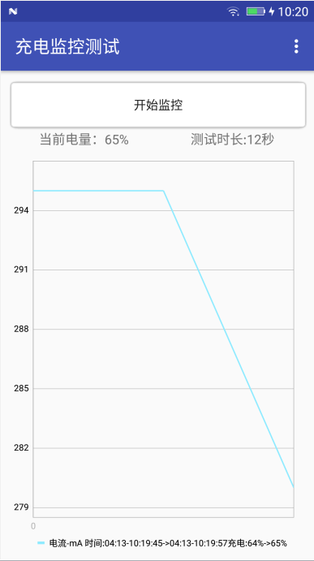
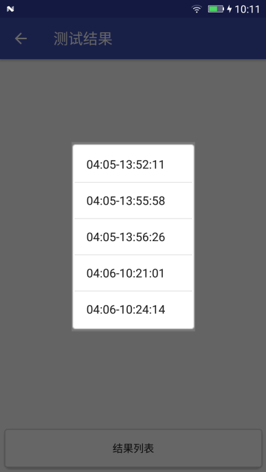
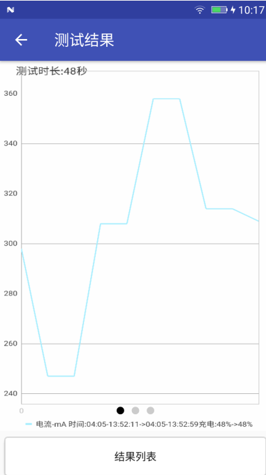

# AutoChargeMap-充电监控工具 #
-----
## 工具简介 ##
监控充电过程对充电电流、充电电压、温度取样，生成一个曲线图，还有统计当前电量到100%所需的总时长。

## 工具界面 ##
### 1.主界面 和 当次测试完成后结果显示界面 ###

### 2.结果列表界面 和 结果详情界面 ###

 

## 工具使用 ##
	1.打开apk, 连接电源, 点击开始监控即可;
	2.测试结果查看:
	测试结束后在主页会显示当次测试的结果; 
	点击右上角的菜单按钮，也可以查看测试结果;
	打开文件管理, 内部存储器/AutoChargeMap/ChargeImage的文件夹中存放着每次测试的结果;

## 参考资料 ##
- [MPAndroidChart](https://github.com/PhilJay/MPAndroidChart)表格绘制

## License ##
- [http://www.apache.org/licenses/LICENSE-2.0](http://www.apache.org/licenses/LICENSE-2.0)